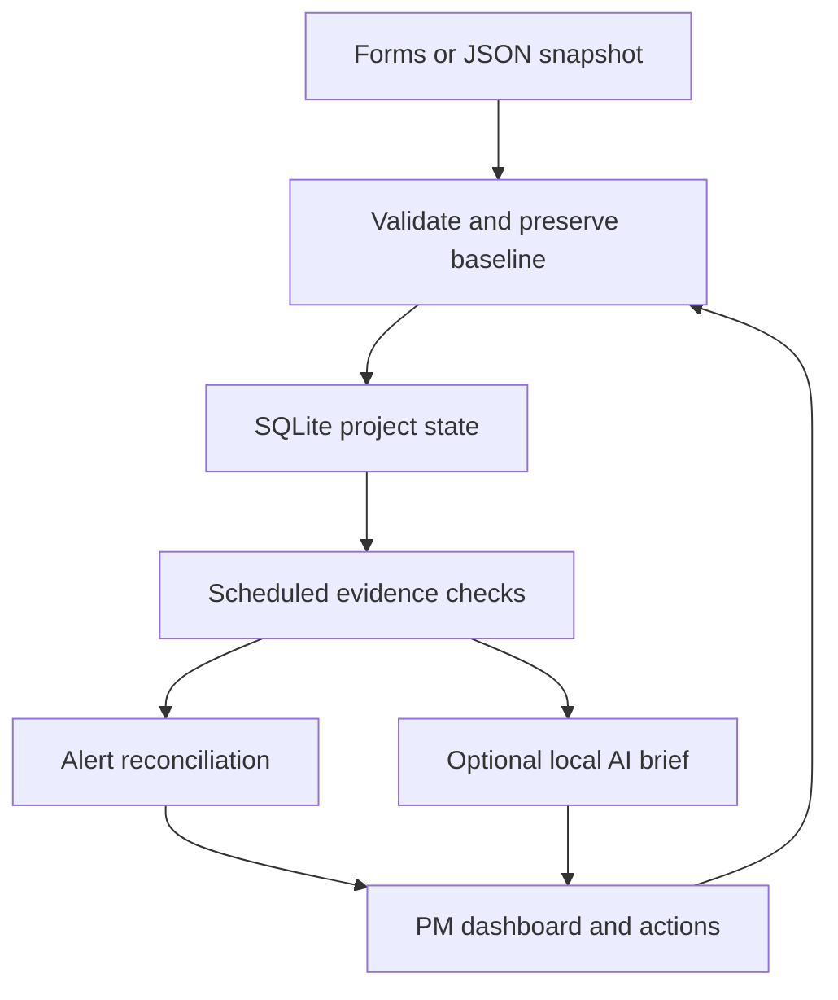

# Architecture and decision rules

## System flow

The process is a deterministic monitoring pipeline with an optional model adapter, not multiple autonomous LLM agents. Four trace entries explain the executed check groups. No model can call tools that change project state.

## Files

| File | Responsibility |
| --- | --- |
| `engine.py` | Schema validation, baseline protection, metrics, detectors, evidence-rule brief |
| `store.py` | SQLite projects, persistent alert lifecycle and assessment history |
| `app.py` | Loopback HTTP API, static UI, background monitor, optional watched-file ingestion |
| `assistant.py` | Optional local Ollama briefing, schema/citation validation and fallback |
| `monitor.py` | Reproducible one-shot CLI analysis |
| `samples.py` | Fictional projects dated relative to startup day |
| `static/` | Dashboard and forms, no frontend framework or build step |

## Calculations

For each baseline task, expected fraction is zero before its planned start, one on/after its due date, and linear between. Zero-duration tasks become expected on their due date. Expected project progress is weighted by original baseline points.

Actual baseline progress uses original points times reported progress. Current-scope completion uses current points, including added work. These denominators are deliberately separate.

| Signal | Default rule |
| --- | --- |
| Schedule | At least 10 percentage points behind; critical at 25 |
| Overdue | Incomplete after current due date; critical after 7 days |
| Date slippage | Current due later than baseline due |
| Target miss | Target date passed with incomplete current scope |
| Scope | Absolute point change at least 10% |
| Budget | Actual spend exceeds budget, or spend percentage leads completion by at least 20 points once 25% of budget is used |
| Dependency | Reported blocked task, or unfinished prerequisite blocked/due too late/already being worked around |
| Capacity | Remaining points due within 7 days, including overdue, exceed owner's weekly point capacity |
| Ownership | An unfinished task has no owner |
| Quality | Any critical defect, at least 5 high defects, or more than 10% tests failing |
| Decision | Open decision past due |
| Evidence | Unfinished task has no update for over 7 days, or records are newer than review date |

These are configurable in code and are product assumptions, not industry standards. Effort points are not hours and are not comparable across teams without a common estimation practice. Delivery status is based on reported progress, not independently verified completion.

The finish scenario extrapolates elapsed days divided by current-scope completion fraction, only when at least 10% is reported complete. This does not model weekends, changing velocity, dependency critical paths or uncertainty. Data issues are shown alongside it. Changing review date does not reconstruct historical actuals.

## Persistence and operations

SQLite stores projects, alert lifecycle and the last 100 changed assessments per project. Stable alert IDs deduplicate scans. Unchanged evidence retains acknowledgement; changed evidence or recurrence reopens it. Resolved alerts remain inspectable. Writes and scans use a process lock and database transactions. The workspace is designed for one local user/process, not concurrent distributed writers.

The watcher imports valid changes atomically. On invalid source data, the last valid assessment stays visible with an error. Dashboard edits do not write back to the watched source.

## Local access boundary

The HTTP service binds to 127.0.0.1, validates Host/Origin for writes, and exposes only allow-listed static paths. There is no login or tenant boundary. This is not an enterprise security design. Private data files are not served as static content. Optional AI requests target local port 11434 only; model prose remains untrusted and is displayed as text.
