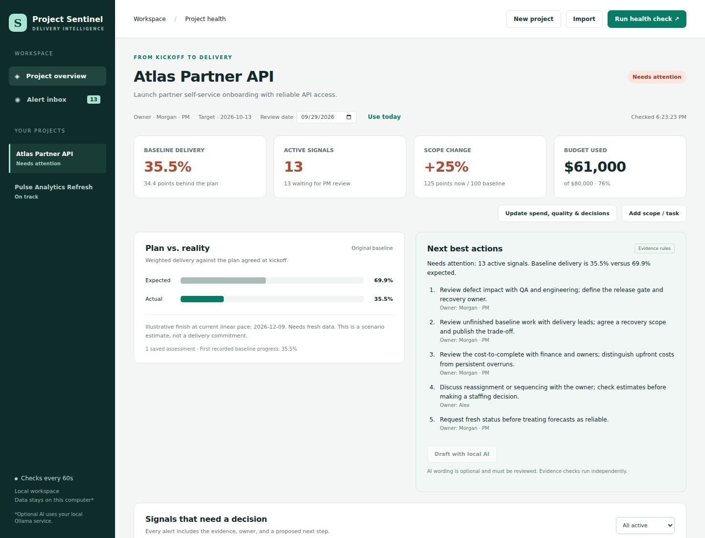

# Project Sentinel
### Know when delivery is drifting—and what to do next.

**A working, local project-monitoring application built from Sai Krishna Banda's product idea.** It compares the original plan with current evidence, maintains an alert inbox, and recommends actions a product manager can review.

A project can look busy while delivery deteriorates. Deadlines move, new requests arrive, one engineer becomes the bottleneck, and status updates go stale. Sentinel makes these changes visible before a status meeting.

[Product brief](PRODUCT.md) · [Architecture](ARCHITECTURE.md) · [Laptop setup](LAPTOP_SETUP.md) · [Validation](VALIDATION.md) · [Sample assessment](examples/atlas-assessment.json)



## Start the application

Requires **Python 3.10+** and a modern browser. The core app has no third-party runtime dependencies and needs no API key.

1. Download this GitHub repository using **Code → Download ZIP** and extract it.
2. Open a terminal in `projects/project-sentinel`.
3. Run:

```sh
python3 app.py
```

On Windows, use `py -3 app.py` or double-click `start-windows.bat`.

4. Open **http://127.0.0.1:8765** on that same computer.

This is a local server application. Opening `static/index.html` directly will not run it. The GitHub page displays the source; it is not a hosted app.

## A five-minute walkthrough

1. Inspect **Atlas Partner API**. It demonstrates several synthetic delivery risks. Compare it with **Pulse Analytics Refresh**, which begins on track.
2. Open an alert. Read its evidence, accountable owner, and suggested action. Acknowledge it; it stays active until the condition clears.
3. Edit **Authentication contract**, set it to Done / 100%, and save. The overdue task signal resolves and downstream assessment changes.
4. Open **Update spend, quality & decisions**. Clear critical/high defects and failing tests, mark the pending decision decided, and save. Those conditions resolve.
5. Use **New project** to enter your own baseline, then **Add scope / task** after kickoff to see scope-change detection.
6. Export the project JSON or download a PM status brief. Stop and restart the server: your project and alert states remain.

## What works

| PM difficulty | Implemented behavior |
| --- | --- |
| Dates drift quietly | Baseline dates stay locked; current dates and overdue work remain visible |
| Activity does not equal delivery | Weighted expected progress compared with reported actual progress |
| Scope grows after kickoff | Current points compared with the original scope; added tasks never rewrite the baseline |
| Spending outpaces delivery | Budget use and current-scope progress compared with explicit thresholds |
| Dependencies stall work | Blocked prerequisites and problematic sequencing identified |
| Owners are overloaded or missing | Seven-day remaining workload versus capacity; missing-owner alerts |
| Quality or decisions threaten release | Critical defects, failed tests and overdue decisions surfaced |
| Status is unreliable | Old updates and records newer than the review date flagged |
| Alerts become noise | Stable IDs, persistent acknowledgement, automatic resolution, reopening when evidence changes |
| Information is scattered | One dashboard, task editor, evidence updates, local JSON import/watch, status-brief export |

The monitor runs every **60 seconds** while the server is running. Closing the browser does not stop monitoring; shutting down or sleeping the laptop does. Alerts are in the application. Email, Slack and mobile push delivery are not implemented.

## AI and agent behavior

The working core is a **rule-driven monitoring workflow**: collect project state → run specialist checks → rank findings → reconcile alert history → suggest next actions. The UI exposes the checks and evidence. This is not an LLM autonomously managing the project.

An optional **local Ollama model** can turn the detected evidence into a reviewable briefing:

```sh
python3 app.py --model YOUR_INSTALLED_LOCAL_MODEL
```

With Ollama serving a local model on port 11434, click **Draft with local AI**. No external model endpoint is configured. The model receives alert evidence only when requested. Outputs must reference known alert IDs; unavailable, malformed or invalid responses fall back to evidence-rule suggestions. Valid IDs do not guarantee correct prose: the AI draft still needs review.

The adapter follows Ollama's [chat API](https://docs.ollama.com/api/chat) and [structured-output documentation](https://docs.ollama.com/capabilities/structured-outputs). Adapter behavior was tested with mock responses; **real model inference has not been validated in this environment**.

## Use your data

Create a project with the UI, or export a sample, edit it and import it. [Data contract](DATA_CONTRACT.md) describes the fields. Importing the same ID updates actuals; modifying its original baseline is rejected. A separately approved rebaseline currently requires a new project ID and manual cross-reference.

For periodic exports from another system, monitor a local JSON file:

```sh
python3 app.py --watch /path/to/project.json --interval 60
```

The file is re-imported when its contents change. Invalid data retains the last valid assessment and shows a monitor error. The watched file is authoritative for actuals and can replace dashboard edits on its next change. Write new exports atomically.

Analyze a snapshot without the server:

```sh
python3 monitor.py examples/atlas.json --as-of 2026-09-29 --output assessment.json
```

## Reproduce verification

```sh
python3 -m unittest discover -s tests -v
```

**39 Python tests and 10 real-browser workflow checks passed** in the recorded implementation run. See [VALIDATION.md](VALIDATION.md) for the exact coverage and outstanding browser/model checks.

## Product boundaries

This is a functional single-user MVP, not a deployed enterprise service. Jira/Asana/Slack connectors, authentication, multi-user authorization, immutable audit logs, managed backups and production hosting are not included. The server binds to the same computer only. Do not expose it directly to the internet.

Synthetic sample data is labeled as such; no customer outcomes, predictive accuracy, real user interviews or employer deployments are claimed. The linear finish estimate is an illustrative scenario, not a calibrated prediction. Self-reported progress and point estimates can be wrong.

Designed as an independent, AI-assisted portfolio project by **Sai Krishna Banda**, showing problem framing, product requirements, delivery-risk rules, working implementation, and testable acceptance criteria.

[Back to the PM portfolio](../../README.md)
